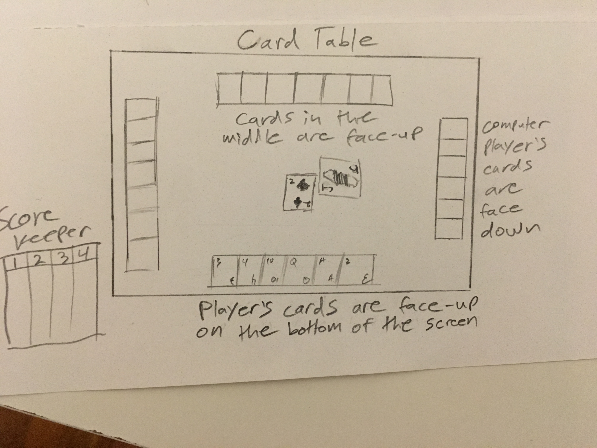
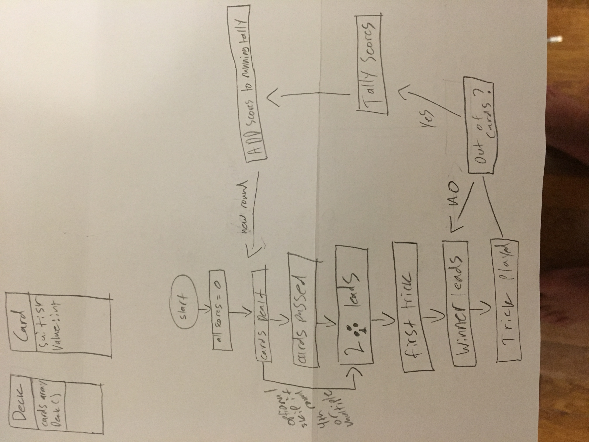

# Hearts

## The Rules

### Scoring
Hearts is a four-handed card game. The goal of the game is to avoid accruing negative points, and get positive points if possible. The Jack of Diamonds is the only card that is worth positive points, and it is worth 10 points. Each heart collected counts as 1 point against you, and the Queen of Spades counts as 13 points against you. If however, you manage to collect all 13 hearts as well as the Queen of Spades those 26 negative points turn positive for you. This is called "shooting the moon."

### The Deal
Each round the full deck is dealt out so each player receives 13 cards. Each player selects 3 cards to pass to another player. The first round cards are passed to the left, the second round to the right, the third round accross the middle, and the fourth round you hold your cards. 

### The Play
After the deal and the swapping of cards, which occurs unless it is the fourth round or a multiple of the fourth round, the player with the 2 of clubs leads. Players take turns playing a card in a clockwise fashion until each player has played one card. Once four cards have been played, the highest card of the suit that led wins the trick and takes all four cards into their own pile which is counted at the end of the round. The player who won the last trick leads with a card of their choosing. Players must follow suit if they are able, but if unable to follow suit, players may play any card of their choosing. The exception to this is on the very first trick where no hearts may be played and the Queen of Spades also may not be played. Before any player can lead a trick with hearts, heart must first be "broken" during the playing of another trick. This means that a suit other than hearts must have been lead, and a player who didn't have any cards of the suit that was lead would break hearts on their turn. Once hearts have been broken any player can lead with hearts. If hearts are lead all players must play a heart higher than the highest heart that has been played during that trick if they are able.

### The Count
After all 52 cards have been played each player counts the cards in their pile. The only cards that count towards anything are the Jack of Diamonds +10 the Queen of Spades -13 and each of the thirteen hearts which are each worth -1 points against you.

### The End?
The game never officially ends. Play as long as you like.

# MVPs

* Users will be able to see the 13 cards they are dealt
* Users cannot see any of the cards held by the 3 computer players
* If it is a passing round users may select 3 cards to pass that will become hidden from them after passing as well as receive 3 cards that will become known to them
* Player must obey game logic
* Players can keep track of how their score and the scores of the 3 computer players changes over time

# Wireframes

# Technologies 

* HTMLDom
* CanvasHTML
* Javascript

# TimeLine

* Card deck object(s) by Wednesday August 14th
* Game Logic by Monday August 17th
* Computer Players by September 5th

## Bonuses
    * game will have cards dealt one at a time
    * cards will be shuffled in an animation